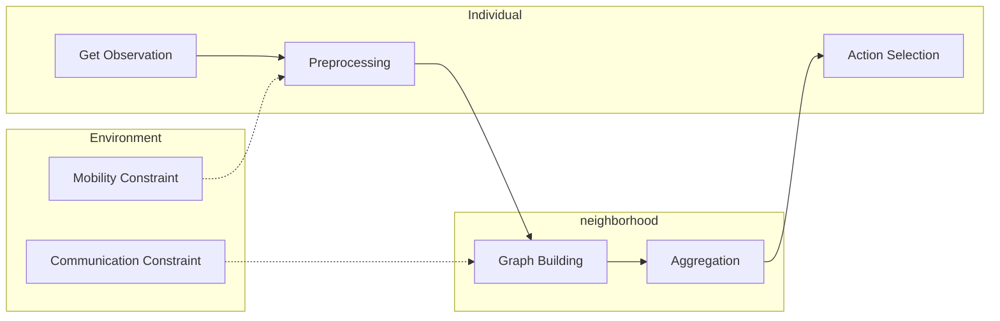

# Co-HETMRS

> This is the repo for ICRA project

## Checking List

- [x] Environment

    - [x] Environment Initialization
    - [x] Environment Update and reset
    - [x] Agents' observation
    - [ ] Other heterogeneity setting

- [ ] Preprocessing

- [ ] Message Passing and Fusion

- [ ] RL Framework

## Pipeline

