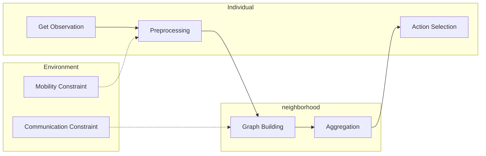

# Co-HETMRS

> This is the repo for ICRA project

## Checking List

- [ ] Environment

    - [x] Environment Initialization
      - [ ] add store and read part
    - [x] Environment Update and reset
    - [x] Agents' observation
    - [ ] Other heterogeneity setting

- [ ] Preprocessing
  - [ ] Agent
  - [ ] Preprocessor

- [ ] Message Passing and Fusioning

- [ ] RL Framework

# Experiment

## Pipeline

