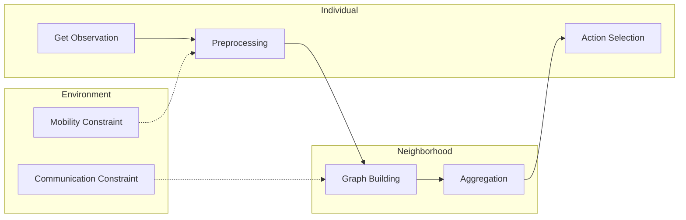

<div align="center">

<div id="user-content-toc">
  <ul align="center" style="list-style: none;">
    <summary>
      <h1>GATAR: Graph Attention Task Allocator</h1>
    </summary>
  </ul>
</div>

<p align="center">
  <em>Task Allocation in Heterogeneous Multi-Robot Systems (UGVs & UAVs)</em>
</p>

<a href="https://www.python.org/"></a> &emsp;
<a href="https://pytorch.org/"></a> &emsp;
<a href="https://pyg.org/"></a> &emsp;
<a href="LICENSE"></a>

<div id="toc">
  <ul align="center" style="list-style: none;">
    <summary>
      <h2><a href="https://ieeexplore.ieee.org/document/10681021">Paper (IEEE RA-L)</a> &emsp; <a href="#pipeline-architecture">Architecture</a> &emsp; <a href="#quick-start">Quick Start</a></h2>
    </summary>
  </ul>
</div>

</div>

# Overview

**GATAR** (Graph Attention Task Allocator) introduces a graph neural operator-based approach for task allocation in systems of heterogeneous robots, specifically Unmanned Ground Vehicles (UGVs) and Unmanned Aerial Vehicles (UAVs).

The model aggregates information from neighbors in a decentralized multi-robot system to achieve globally optimal target localization. By operating without a central command, GATAR is highly robust and adaptable to dynamic scenarios where the number of robots and tasks fluctuates over time.

### Key Features

- **Decentralized & Robust:** Operates locally on each agent, providing resilience against single points of failure.
- **Heterogeneity-Aware:** Utilizes specialized preprocessing to bridge the gap between different agent types (e.g., varying mobility and sensor capabilities).
- **Scalable Performance:** A single trained model handles fleets ranging from 2 to 12 robots without retraining, outperforming traditional architectures.

# Pipeline Architecture

GATAR processes observations through a graph-based message-passing pipeline. Each agent builds a local neighborhood graph to facilitate information fusion and action selection.


```mermaid
graph LR
    A[Get Observation]
    B[Preprocessing]
    C[Graph Building]
    D[Aggregation]
    E[Action Selection]
    F[Communication Constraint]
    G[Mobility Constraint]

    subgraph Environment
    F
    G
    end

    subgraph Neighborhood
        C
        D
        C-->D
    end
    
    subgraph Individual
        B
        A
        A-->B
        E
    end

    direction LR
    B-->C
    D-->E

    F -.-> C
    G -.-> B
```

# Quick Start

### Installation

We recommend using Conda to manage your dependencies.

**1. Create the Environment**
```bash
conda create -n gatar_env python=3.10 -y
conda activate gatar_env
```

**2. Install PyTorch & PyG**
*(Ensure your CUDA version matches the URL; example uses cu118)*
```bash
pip install torch torchvision torchaudio --index-url [https://download.pytorch.org/whl/cu118](https://download.pytorch.org/whl/cu118)
pip install torch_geometric
pip install pyg_lib torch_scatter torch_sparse torch_cluster torch_spline_conv -f [https://data.pyg.org/whl/torch-2.0.0+cu118.html](https://data.pyg.org/whl/torch-2.0.0+cu118.html)
```

**3. Install Remaining Dependencies**
```bash
pip install pyyaml numpy tqdm imageio tensorboard
```

# Development Roadmap

- [ ] **Environment**
    - [x] Initialization & Update/Reset
    - [ ] Dynamic Store/Read implementation
    - [x] Multi-agent observation space
- [ ] **Preprocessing**
    - [ ] Heterogeneity-aware modeling
- [ ] **Graph Operations**
    - [ ] Decentralized Message Passing (GATv2Conv)
- [ ] **Reinforcement Learning**
    - [ ] DQN Integration & Training Loop

# Citation

If you use this work, please cite the published journal paper:

```bibtex
@article{peng2024gatar,
  title={Graph-Based Decentralized Task Allocation for Multi-Robot Target Localization},
  author={Peng, Juntong and Viswanath, Hrishikesh and Bera, Aniket},
  journal={IEEE Robotics and Automation Letters},
  volume={9},
  number={11},
  pages={10676--10683},
  year={2024},
  publisher={IEEE}
}
```

# Acknowledgments

This codebase is inspired by or partly uses code from the following repositories:

- [NeuralOperator](https://github.com/neuraloperator/neuraloperator) for the foundation of graph neural operator architectures.
- [PyG (PyTorch Geometric)](https://github.com/pyg-team/pytorch_geometric) for graph processing and convolution layers.
